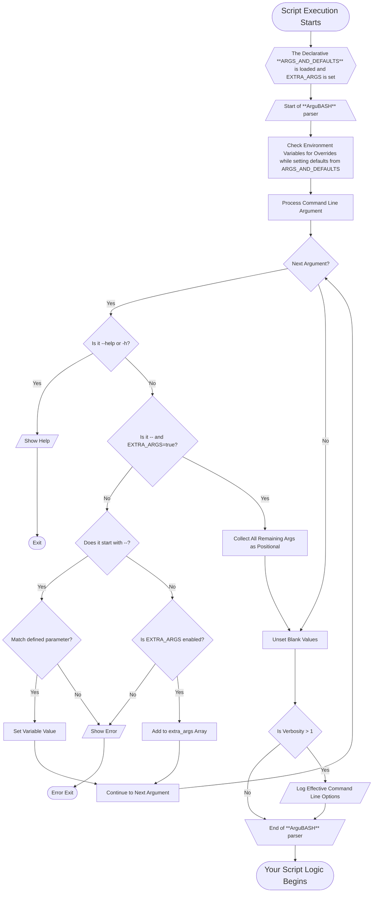

# ArguBASH

ArguBASH is a declarative argument parser for Bash scripts that makes command-line option handling easy, clean, consistent, and powerful.  It provides a structured way to define script arguments with defaults and help text, eliminating the need to write complex argument parsing logic for each script.

A key benefit of ArguBASH is that it can create completely self-contained scripts with no external dependencies.  The argument parser is embedded directly within your script, ensuring your scripts will run reliably anywhere Bash is available, without requiring users to install additional packages or libraries.

## Quick Start

To quickly implement ArguBASH in your script:

```bash
#!/bin/bash

#################################################################
# ARGUMENT DEFINITION
ARGS_AND_DEFAULTS=(
   # Source directory for operations
   source_dir="$(pwd)"

   # Enable verbose output
   verbose=false
)
# END of ARGUMENT DEFINITION
#################################################################

# Copy the ARGUMENT PARSER section from ArguBASH-template.sh here

# After the parser, your script can use the variables directly
if [[ ${verbose} == true ]]; then
    echo "Operating in verbose mode on directory: ${source_dir}"
fi

# Your script logic here...
```

1. Define your arguments and defaults in the `ARGS_AND_DEFAULTS` array
2. Copy the ARGUMENT PARSER section from [`ArguBASH-template.sh`](./ArguBASH-template.sh)
3. Use your arguments as standard Bash variables in your script
4. (Optional) [Enable tab completion](#tab-completion) for a better interactive experience

## Features

- **Completely Self-Contained**: Creates standalone scripts with no external dependencies
- **Declarative Argument Definition**: Define arguments and their defaults in a simple array structure
- **Automatic Help Generation**: Comments become help text automatically
- **Basic Argument Validation**: Validates argument names and structure (not values)
- **Environment Variable Support**: Default values can be overridden by environment variables
- **Command-line/Variable Name Conversion**: Automatic conversion between command-line options with dashes (`--vm-sku`) and script variables with underscores (`vm_sku`)
- **Positional Arguments Support**: Optionally capture remaining arguments with support for the `--` delimiter
- **Tab Completion**:
  - Supports Bash tab completion for all defined arguments
  - Enhanced Zsh completion that displays help text descriptions and default values directly in the completion menu, leveraging ArguBASH's declarative structure

## Installation

### Basic Usage

To use ArguBASH in your scripts, copy the argument parser section from the [`ArguBASH-template.sh`](./ArguBASH-template.sh) file into your script. The section is clearly marked with:

```bash
##################################################################
# ARGUMENT PARSER
...
# END of ARGUMENT PARSER
##################################################################
```

This approach ensures your script is completely self-contained with no external dependencies.  Users won't need to install anything special to run your script—just Bash itself.

The typical structure of an ArguBASH-powered script is:

1. Script header (shebang, copyright, description)
2. ARGUMENT DEFINITION section with your `ARGS_AND_DEFAULTS` array
3. ARGUMENT PARSER section copied from `ArguBASH-template.sh`
4. Your custom script logic that uses the defined variables

## Usage

### Argument Definition

Define your arguments in the `ARGS_AND_DEFAULTS` array:

```bash
ARGS_AND_DEFAULTS=(
   # The directory to operate on, defaults to current directory
   dir="$(pwd)"

   # The verbosity level of script output
   # 0 = minimal output (quiet)
   # 1 = standard logging (recommended)
   # 2 = detailed debugging output
   verbosity=1

   # Run in simulation mode without making actual changes
   dry_run=false
)
```

Notes:
- Comments above each argument are used as help text
- Only comments starting with `# ` (hash and space) are used for help text
- Comments starting with `##` are for script maintainers and won't appear in help

## Positional Arguments

ArguBASH supports positional arguments, which are arguments that aren't associated with a specific named parameter.  These are commonly used for file paths, commands, or other values that make sense as primary inputs to your script.

### Enabling Positional Arguments

To enable positional arguments in your script, set `EXTRA_ARGS=true` at the beginning of your ARGUMENT DEFINITION section:

```bash
# Enable collection of positional arguments
EXTRA_ARGS=true
# Array to hold the positional arguments
extra_args=()
```

### How Positional Arguments Work

When enabled, ArguBASH collects positional arguments in two ways:

1. **Implicit positional arguments**: Any command-line argument that doesn't start with `--` and isn't a value for a named parameter is treated as a positional argument.

2. **Explicit positional arguments using the standard `--` delimiter**: Following the universal Unix/Linux convention, any arguments that appear after a standalone `--` delimiter are treated as positional arguments, even if they start with dashes.  This is critical when you need to pass arguments that begin with dashes (which would normally be interpreted as options) as actual values.

The `--` delimiter (end-of-options marker) is an established standard across Unix/Linux tools and is especially important when:
- Working with filenames or paths that begin with a dash
  - such as `rm -- *` in case the files include a file with a leading `-`
- Handling arguments that might be interpreted as options

All positional arguments are stored in the `extra_args` array, which you can access in your script logic.

### Examples of Positional Argument Usage

#### Basic positional arguments:

```bash
./my-script.sh --verbose true file1.txt file2.txt
```

In this example, `file1.txt` and `file2.txt` are collected as positional arguments.

#### Using the `--` delimiter:

```bash
./my-script.sh --verbose true -- foo --output-file report.txt
```

Here, `--output-file` and `report.txt` are treated as positional arguments because they appear after the `--` delimiter, even though `--output-file` looks like a named parameter to the script but in this case is really a parameter to the `foo` thing (potentially a command your script wrappers).

### Accessing Positional Arguments in Your Script

You can access the positional arguments using standard bash array operations:

```bash
# Check if there are any positional arguments
if [[ ${#extra_args[@]} -gt 0 ]]; then
    # Access the first positional argument
    first_arg="${extra_args[0]}"

    # Iterate through all positional arguments
    for arg in "${extra_args[@]}"; do
        echo "Processing: ${arg}"
    done

    # Get the total number of positional arguments
    num_args=${#extra_args[@]}
    echo "Received ${num_args} positional arguments"
fi
```

### When to Use Positional Arguments

Positional arguments are useful for:

- File or directory paths that are primary inputs to your script, especially if there can be an arbitrary number of them.
- Wrapped commands - when your script acts as a wrapper for other commands and their options
- Simplifying the interface when parameters have a natural, expected order such as `cp fromfile tofile` does.

For important configuration options that might be missed, named parameters (with `--name value` syntax) are generally more self-documenting and should be preferred.

### Command Line Usage

Your script will automatically support:

```bash
./your-script.sh --argument value [--help|-h] [positional args]
```

For example:
```bash
./your-script.sh --dir /some/path --verbosity 2
```

### Help Display

- `-h` shows a brief summary of arguments
- `--help` shows detailed help with all comments

Example brief help output (`-h`):
```
Usage: ./example-command.sh [--<override> value] [--help|-h] <positional args>
    --dir        default: /workspace/src
    --verbosity  default: 1
    --dry-run    default: false
    --parallel   default: 4
    --           pass remaining arguments
    --help       for more complete help
```

Example detailed help output (`--help`):
```
Usage: ./example-command.sh [--<override> value] [--help|-h] <positional args>
    --dir        default: /workspace/src
                 original: "$(pwd)"
                 The directory to operate on, defaults to current directory
                ------------------------------------------------------
    --verbosity  default: 1
                 Verbosity level (0=quiet, 1=normal, 2=verbose)
                 Controls how much information is displayed during execution
                ------------------------------------------------------
    --dry-run    default: false
                 Run in simulation mode without making changes
                 Set to true to see what would happen without actual execution
                ------------------------------------------------------
    --parallel   default: 4
                 Maximum number of parallel operations
                 Higher values may improve performance but use more resources
                ------------------------------------------------------
    --           pass remaining arguments
    -h           for quick argument summary
```

## Example

Here's a simple example script ([example-command.sh](./example-command.sh)):

```bash
#!/bin/bash

#################################################################
# ARGUMENT DEFINITION
#
EXTRA_ARGS=true
extra_args=()
ARGS_AND_DEFAULTS=(
   # The directory to operate on, defaults to current directory
   dir="$(pwd)"

   # Verbosity level (0=quiet, 1=normal, 2=verbose)
   # Controls how much information is displayed during execution
   verbosity=1

   # Run in simulation mode without making changes
   # Set to true to see what would happen without actual execution
   dry_run=false

   # Maximum number of parallel operations
   # Higher values may improve performance but use more resources
   parallel=4
)
# END of ARGUMENT DEFINITION
##################################################################

# Copy the ARGUMENT PARSER section from ArguBASH-template.sh here

# Your script logic starts here
echo "This is a no-op example command that just shows the arguments:"
echo "  Directory: ${dir}"
echo "  Verbosity: ${verbosity}"
echo "  Dry run: ${dry_run}"
echo "  Parallel: ${parallel}"
if [[ ${#extra_args[@]} -gt 0 ]]; then
   echo "  Extra args:"
   for xtra in "${extra_args[@]}"; do
      echo "      | ${xtra}"
   done
fi
```

### Running with Different Arguments

The example script supports various argument patterns:

#### Basic Usage with Named Arguments

```bash
./example-command.sh --dir /tmp --verbosity 2 --dry-run true
```

Output:
```
This is a no-op example command that just shows the arguments:
  Directory: /tmp
  Verbosity: 2
  Dry run: true
  Parallel: 4
```

#### Using Positional Arguments

When `EXTRA_ARGS=true`, any arguments not matching a defined parameter are collected as positional arguments:

```bash
./example-command.sh --dir /tmp file1.txt file2.txt
```

Output:
```
This is a no-op example command that just shows the arguments:
  Directory: /tmp
  Verbosity: 1
  Dry run: false
  Parallel: 4
  Extra args:
      | file1.txt
      | file2.txt
```

#### Using the Standard `--` Delimiter

The `--` delimiter is the standard Unix/Linux convention for marking the end of option processing.  This is essential when you need to pass values that might otherwise be interpreted as options:

```bash
# Pass a filename that starts with a dash
./example-command.sh --verbosity 1 -- -my-filename.txt

# Pass a negative number as a positional argument
./process-data.sh --scale 2 -- -10.5

# Ensure all subsequent arguments are treated literally, not as options
./secure-script.sh --config settings.conf -- --potentially-dangerous-flag
```

Example output with the example script:

```bash
./example-command.sh --verbosity 1 -- --this-looks-like-an-option but-its-a-positional-arg
```

Output:
```
This is a no-op example command that just shows the arguments:
  Directory: /workspace/src
  Verbosity: 1
  Dry run: false
  Parallel: 4
  Extra args:
      | --this-looks-like-an-option
      | but-its-a-positional-arg
```

Without the `--` delimiter, the script would attempt to interpret `--this-looks-like-an-option` as a named parameter, resulting in an error since it's not defined.

#### Showing Effective Command Line Options

When running with verbosity level 2, the script shows the effective command line options, including default values:

```bash
./example-command.sh --verbosity 2 input.txt
```

Output:
```
Running with these effective options:

./example-command.sh --dir /workspace/src --verbosity 2 --dry-run false --parallel 4 -- input.txt

This is a no-op example command that just shows the arguments:
  Directory: /workspace/src
  Verbosity: 2
  Dry run: false
  Parallel: 4
  Extra args:
      | input.txt
```

### Environment Variable Overrides

ArguBASH allows users to set environment variables that match the argument names to override the defaults.  For example:

```bash
# Set default verbosity to 2 for all ArguBASH scripts that use this argument
export verbosity=2

# Run script - it will use verbosity=2 without needing --verbosity 2
./your-script.sh

# Command line arguments override environment variables
./your-script.sh --verbosity 3  # Uses verbosity=3
```

This makes it easy to set common preferences without modifying scripts or always having to provide the same arguments.

### Implementing Your Own Validation

ArguBASH performs basic validation on argument names and structure (ensuring they're valid bash variables and properly formatted), but it doesn't validate the values provided by users.  For important arguments, you should implement your own validation logic after the argument parser section:

```bash
# After the ARGUMENT PARSER section:

# Validate that the directory exists
if [[ ! -d ${dir} ]]; then
   _error "Directory '${dir}' does not exist"
   exit 1
fi

# Validate that verbosity is within expected range
if ! [[ ${verbosity} =~ ^[0-2]$ ]]; then
   _error "Verbosity must be between 0 and 2, got '${verbosity}'"
   exit 1
fi
```

This pattern lets you enforce constraints on argument values that are specific to your script's requirements.

## Real-World Examples

For more complex, real-world examples of ArguBASH in action, check out the [Boxed project on GitHub](https://github.com/MichaelSinz/Boxed):

- [`boxed.sh`](https://github.com/MichaelSinz/Boxed/blob/main/boxed.sh) - A script that runs Docker containers with specific behaviors and arguments
- [`build.sh`](https://github.com/MichaelSinz/Boxed/blob/main/build.sh) - A build script with extensive argument options

These examples demonstrate how ArguBASH can be used in production scripts with many arguments and complex validation requirements.

## Tab Completion

ArguBASH supports tab completion for both Bash and Zsh shells, making it easier to use your scripts interactively.

### Bash Completion

To enable tab completion for ArguBASH scripts in Bash:

1. Place the completion script in a convenient location:
   ```bash
   # Create a directory for Bash completions if it doesn't exist
   mkdir -p ~/.bash_completion.d

   # Copy the completion script
   cp /path/to/ArguBASH-completion ~/.bash_completion.d/

   # Make sure it's executable
   chmod +x ~/.bash_completion.d/ArguBASH-completion
   ```

2. Source the completion script in your `~/.bashrc` or `~/.bash_profile`:

   For newer Bash versions (4.0+):
   ```bash
   # Add to your ~/.bashrc or ~/.bash_profile
   source ~/.bash_completion.d/ArguBASH-completion
   ```

   For older Bash versions (such as the default on macOS):
   ```bash
   # Add to your ~/.bashrc or ~/.bash_profile with specific commands
   source ~/.bash_completion.d/ArguBASH-completion command1 command2 ...
   ```

3. Reload your Bash configuration or start a new shell session:
   ```bash
   source ~/.bashrc  # or source ~/.bash_profile
   ```

The [ArguBASH-completion](./ArguBASH-completion) script will automatically detect ArguBASH-compatible scripts and provide tab completion for their arguments.

#### Global install

If you wish to install this for all users, a common location is the `/etc/bash_completion.d` directory.  Just copy the `ArguBASH-completion` file to that directory.  If that directory exists, that is the best place to put if for global access.

```bash
cp ArguBASH-completion /etc/bash_completion.d/
```

Once it is there, you just need to start a fresh login shell to test it:

```bash
bash -l
# now test argument tab completion with ./example-command.sh --v_TAB_ to see it working
```

### Zsh Completion

For Zsh users, ArguBASH includes a dedicated completion script that follows Zsh conventions:

1. Place the `_ArguBASH-completion` script in a directory in your `$fpath` (the leading underscore in the filename is intentional and follows Zsh conventions):
   ```bash
   # Create a directory for Zsh completions if it doesn't exist
   mkdir -p ~/.zsh/site-functions

   # Copy the completion script
   cp /path/to/_ArguBASH-completion ~/.zsh/site-functions/

   # Make sure it's executable
   chmod +x ~/.zsh/site-functions/_ArguBASH-completion
   ```

2. Ensure the completion directory is in your `$fpath`. Add this to your `~/.zshrc`:
   ```bash
   # Add the site-functions directory to fpath
   fpath=(~/.zsh/site-functions $fpath)
   ```

3. Rebuild the Zsh completion cache:
   ```bash
   rm -f ~/.zcompdump
   compinit
   ```

Once installed, any script using ArguBASH argument parsing will automatically get tab completion for its defined arguments when using Zsh.

#### Global install

If you wish to install Zsh completion for all users on the system, you can place the completion script in one of the standard system-wide directories.

**Choosing the right directory:**
- On **Linux**: Use `/usr/share/zsh/site-functions/` (standard location for most distributions)
- On **macOS**: Use `/usr/local/share/zsh/site-functions/` (preferred for user-installed software)

If both directories exist on your system (common on macOS):
- Choose `/usr/local/share/zsh/site-functions/` if you're installing manually or via a package manager like Homebrew
- Choose `/usr/share/zsh/site-functions/` only if you're integrating with system packages

Installation commands:

```bash
# For Linux systems (standard location)
sudo cp _ArguBASH-completion /usr/share/zsh/site-functions/
sudo chmod +x /usr/share/zsh/site-functions/_ArguBASH-completion

# For macOS or Homebrew-based Linux systems (preferred for user software)
sudo cp _ArguBASH-completion /usr/local/share/zsh/site-functions/
sudo chmod +x /usr/local/share/zsh/site-functions/_ArguBASH-completion
```

After installing to a system directory, users will need to either start a new Zsh session or rebuild their completion cache:

```bash
# Rebuild Zsh completion cache
rm -f ~/.zcompdump
compinit
```

These system directories are already in the default `$fpath`, so users won't need to modify their `~/.zshrc` files.

## Limitations

- Values cannot start with a dash `-`
- Older Bash versions (pre-4.0) require explicit completion setup for each command

---
## How ArguBASH Works

For those curious souls who enjoy peering under the hood, this section provides some technical details of how ArguBASH actually processes your arguments.  While not essential for basic usage, understanding these internals can help you leverage ArguBASH more effectively or troubleshoot any issues that might arise.  Feel free to dig in if you like getting your hands dirty, or skip if you're just looking to use ArguBASH in your own code.

When processing command line arguments:
- Internal variable names use underscores: `vm_sku`
- Command line options use dashes: `--vm-sku`
- This conversion happens automatically in the argument parser

The argument parser is embedded directly in your script, making it:
- Completely self-contained with no external dependencies
- Portable across different environments
- Easy to distribute without worrying about dependency management
- Consistent in behavior regardless of the environment

The parser:
1. Sets all default values (unless already set in the environment)
   - This lets users override defaults by setting environment variables (e.g. `export verbosity=2`)
2. Processes command line arguments, overriding defaults and environment variables
3. Provides help functionality with `-h` or `--help`
4. Handles validation and error reporting
5. Collects positional arguments if enabled

### Understanding the Argument Processing Flow

To help visualize how ArguBASH processes command-line arguments, here's a flowchart showing the inner workings of the argument parser:



#### Key Processing Steps

1. **Initialize with Defaults and Environment Variables**:
   - Set default values from the `ARGS_AND_DEFAULTS` array
   - Check for and apply environment variable overrides during this process
   - This creates the base state before processing command-line arguments

2. **Parse Command Line Arguments**: Process each argument in sequence:
   - If it's `-h` or `--help`, show help and exit
   - If it's `--` and `EXTRA_ARGS=true`, collect all remaining arguments as positional arguments
   - If it starts with `--`, try to match it with a defined parameter
     - If matched, set the variable and continue
     - If not matched, show error and exit
   - If it doesn't start with `--`:
     - If `EXTRA_ARGS=true`, add it to the `extra_args` array
     - Otherwise, show error and exit

3. **Final Processing**:
   - Unset any blank values (for later conditional checks)
   - Log effective command line options if verbosity is high enough
   - Begin your script logic with validated arguments

This flow ensures that arguments are processed in a predictable order of precedence:
1. **Default values** (lowest precedence)
2. **Environment variables** (override defaults)
3. **Command line arguments** (highest precedence)

### How Tab Completion Works

The ArguBASH tab completion system is designed to automatically detect and provide completions for any script using the ArguBASH pattern.  Here's how it works:

1. **Script Detection**: When you type a command and press Tab, the completion function:
   - Checks if the command exists as a file
   - Verifies it's a bash script
   - Scans for the `ARGS_AND_DEFAULTS=(` pattern near the top of the file
   - If found, identifies it as an ArguBASH-compliant script

2. **Argument Extraction**: If the script is detected as ArguBASH-compatible:
   - Parses the script to extract all argument names from the `ARGS_AND_DEFAULTS` array
   - Builds a list of valid `--argument` options using the same parsing logic as the ArguBASH parser

3. **Completion Generation**: Based on what you've typed so far:
   - If you're typing an option (starting with `-`), it offers matching options
   - If you've just entered an option and need a value, it lets Bash use standard completion

4. **Version-specific Handling**:
   - Newer Bash versions (4.0+): Uses dynamic command detection and argument extraction
   - Older Bash versions: Requires explicit registration of commands for completion

The completion system is designed to be:
- **Zero-configuration**: Works automatically for properly structured scripts
- **Lightweight**: Adds minimal overhead to the shell
- **Discoverable**: Helps users find available options
- **Consistent**: Provides predictable behavior across different scripts

## License

See the [LICENSE](./LICENSE) file for details.